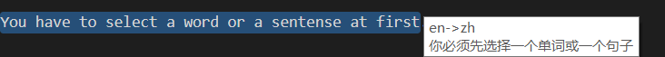
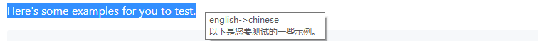
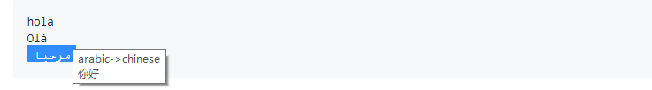

# CapsLock++
[中文说明](https://github.com/matrix1001/capslock-plus-plus/blob/master/README-zh.md)

Amazing, extendable, readable `autohotkey` scripts framework utilized by `Capslock`.

__New Features__
- double click to translate!
# Feature
- Plug in and play
- Function based script
- Translation
- WindowSwitch
- Tabscript
- Autoload configuration and script
  
This project is in progress. Other fantastic funtions will be joined.
# Update
This project is updating very quickly. If you pulled the latest version, remember to delete the old `ini` files in order to load new ones to gain new features.
# Usage
## Basic
Basic usage is according to the default settings. If you are not starter of `AHK`, just ignore this. These settings are in `HyperSettings.ini`.

In the following part, I will ignore `capslock` in keyset.

| key | function |
| ------ | ------ |
| ` | toggle capslock|
| alt+1 | switch to virtual desktop 1 |
| alt+2 | switch to virtual desktop 2 |
| alt+3 | switch to virtual desktop 3 |
| h | move left |
| j | move down |
| k | move up |
| l | move right |
| u | page up |
| p | page down |
| i | move to start |
| o | move to end |
| c | copy |
| v | paste |
| ↑ | volumne up |
| ↓ | volumne down |
| ← | prev virtual desktop |
| → | next virtual desktop |
| space | toggle window always on top |
| 1,2,3,4,5 | window bind |
| tab | tab script |
| t | google translate |
| alt+s | reload settings |
| alt+r | reload script |
| alt+t | enable double click translate |

By the way, you may want to `suspend` | `restart` the script when you play games. Press `Alt + Esc` will help. And its icon will change.

Here follows the basic configuration in `HyperSettings.ini`
```ini
[Basic]
Admin=0 ;run as admin
DebugMsg=0 ;debug msg, check it by your selt
Icon=hyper.ico
InfoMsg=1
ScriptMonitor=1 ;notify you about the changes of the scripts
SettingMonitor=1 ;notify you about the chagnes of the setting
StartUp=1 ;start on windows start
SuccessMsg=1
WarningMsg=1
```

## Translation
Default translation is triggered by `Capslock + t`. You have to select a word or a sentense at first.

Here's some examples for you to test.
```
hola
Olá
 مرحبا 
```
Here's some picture for demo.




Also, language support has been added to `HyperSettings.ini`. Remember to use the language shortcut.
```ini
[Trans]
SourceLanguage=auto
TargetLanguage=zh ; for example, change this to es (spanish)
```

__Surprising New Feature__
Double Click To Translate
- First press `Capslock + Alt + t` to enable/disable it.
- Then double click a work, it will be translated!
## WindowSwitch
WindowSwitch is designed for quick switch between multiple windows. Extremely good for those who need to work with multiple window applications.

I have implemented 2 types of window switch functions.

### Type 1
- `WindowA` can be used for most applications.
- `WindowB` should be used for `web browser`. There is little difference from `WindowA`

These two functions need to be configured before you use it.

Check default HyperWinSettings.ini
```ini
[Chrome]
exe=C:\Program Files (x86)\Google\Chrome\Application\chrome.exe
id=ahk_class Chrome_WidgetWin_1 ahk_exe chrome.exe
key=a
typ=B
```
Just put infomation of your application here, and assign a `key` to it, then you can use it by press `Capslock + key`.
`key` can also be `alt_a` if you want `Capslock + alt + a`.

About `id`, you can figure it out by using `windowspy`, which it installed by `autohotkey`.

After you finish configuration, it will be auto loaded. The manner of `Type 1` functions is:
- Start your application if not started
- Active your application window if not actived
- Minimize your application window if actived
  
### Type 2
- `WindowC` can dynamicly bind any window.

`Type 2` function does not require any configuration. But it need to be assigned to keymap.

Check Default HyperSettings.ini
```ini
[Keymap]
hyper_1=WindowC(1)
hyper_2=WindowC(2)
hyper_3=WindowC(3)
hyper_4=WindowC(4)
hyper_5=WindowC(5)
hyper_minus=WindowCClear
```
The manner is similar to `Type 1`:
- If no window bind, bind current window
- Active your application window if not actived
- Minimize your application window if actived

To clear a window bind, you got two ways.
- Close the binded window, press its binded key again
- Press `Casplock + -`, then its binded key

I only assign 5 `WindowC` by default. It supports at most 10 window. But I guess you will never use that much.
## TabScript
TabScript helps you to auto complete some long strings with simple words, triggerd by `CapsLock + Tab`.

Take a look at default HyperSetting.ini, you will find this
```ini
[TabHotString]
sample=this is a TabHotString sample
date1=<GetDateTime>
date2=<GetDateTime("yyyy-M-d")>
```
Move your cursor after the word `sample`, press `CapsLock + Tab`, and it will be auto replaced by `this is a TabHotString sample`

However, I have implemented function support.

In `lib/basicfunc.ahk`, you will find this function
```ahk
GetDateTime(fmt := "yyyy/M/d")
{
    FormatTime, CurrentDateTime,, %fmt%
    return CurrentDateTime
}
```

And just use function between `<>`, it will be automaticly evaluated. What if I need to use `<` or `>` instead of a function call? Use `<<`, `>>` instead. 

Example
```
[before] date1 -> [after] 2018/10/6
[before] date2 -> [after] 2018-10-6
```
Also multiple functions call is supported.

If you want to add your TabScript into it, just change HyperSettings.ini. If you need other function, check `UserScript` in `Usage`.


## UserScript
Now if want to put your script into `capslock++.ahk`, your have to follow these:
- All scripts should not use `global`. If your global variable is important, put them into `HyperSettings` (check `settings.ahk`). However, if you insist to use `global`, there is little chance to get you into trouble.
- All scripts are function based. Prevent the use of `label`.
- If some function can be reused by other script, put it into `basicfunc.ahk`. Also you can `#include lib/basicfunc.ahk` only.
- Leave one function as a entry for keymap.

Then:
- Just move your script into `lib` or `script`, it will be auto loaded.
- If your want to map a key to it, just change `HyperSettings.ini`, it will be auto loaded.

## Modification
Any modification of `ahk` script (scripts in `lib` and `script`, and `capslock++.ahk`) will trigger `Reload`. However there will be a message box to confirm.
# Documention
TODO

# Devlog
## 2018/10/11 version 0.1.7
- add multi lines translation
- add suspend msg
## 2018/10/10 version 0.1.6
- chinese version readme
- refine `settings.ahk`
- add language choise in `HyperSettings.ini`
- add double click to translate

## 2018/10/9 version 0.1.5
this is a most bug-fix edition
- fix startup error
- fix `mouseisover` function not found
- fix userinput block when call `windowcclear`
- better error/exception message
- better notification ui
- fix `windowc` bind the desktop

TODO:
- chinese version

## 2018/10/8 version 0.1.4
- add tranlation tooltip
- add `httpget`, `tooltip` to basicfunc
## 2018/10/7 version 0.1.3
- add some useful basic func, like `splashtext`, `streq`..
- refine includer to avoid some problem
- add more option like `icon`, `admin` in INI file
- add windowswitch usage to readme
## 2018/10/6 version 0.1.2
- add function support to tabscript
- add tabscript usage to readme
## 2018/10/5 version 0.1.1
- add desktoputil
- better autoloader and settingwatcher
- add startup support
- add some usage
## 2018/10/4 version 0.1.0
- init commit
- add auto includer (all ahk file will be auto include, so you don't need to write a `#Include`)
- add hot change support (autoload scripts and .ini)