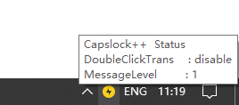
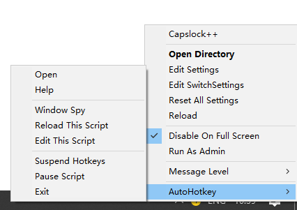
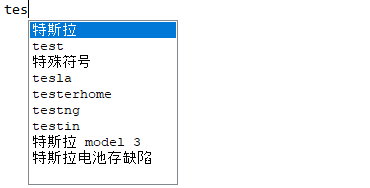

<span style="display:block;text-align:center"></span>

# CapsLock++

[中文说明](https://github.com/matrix1001/capslock-plus-plus/blob/master/README-zh.md)

Amazing, extendable, readable `autohotkey` scripts framework utilized by `Capslock`.

Original core concept is to make your `Capslock` key as a new `fn`. You have to install [AutoHotkey](https://autohotkey.com/) first. 

[Latest Release V0.2.2](https://github.com/matrix1001/capslock-plus-plus/archive/V0.2.2.zip)

__New Features__

- Intelligent Search! 
- HyperTab enhancement! (merge autosuggest function into HyperTab)

__Notice__

This project is updating very quickly. If you pulled the latest version, **remember** to delete the old `ini` files in order to load new ones to gain new features.

# Feature

- Plug in and play & Function based script & Easy to read
- **HyperTrans** (translation)
- **HyperSwitch** (switch windows quickly)
- **HyperTab** (intelligent replace & search text)
- **HyperSearch** (intelligent search)
- **HyperNotify** (amazing UI for notification)
  
This project is in progress. Other fantastic functions will be joined.

# Usage

## Basic

Basic usage is according to the default settings. If you are not starter of `AHK`, just ignore this. These settings are in `HyperSettings.ini`.

In the following part, I will ignore `capslock` in keyset.

| key | function | description |
| ------ | ------ | ------ |
| ` | toggle capslock|
| alt+1 | switch to virtual desktop 1 | win10 only
| alt+2 | switch to virtual desktop 2 | create desktop before you use it
| alt+3 | switch to virtual desktop 3 |
| h | move left |
| j | move down |
| k | move up |
| l | move right |
| u | page up |
| p | page down |
| i | move to start |
| o | move to end |
| c | copy |
| v | paste |
| ↑ | volume up | invisible in win7, but visible in win10
| ↓ | volume down |
| ← | prev virtual desktop |
| → | next virtual desktop |
| space | toggle window always on top |
| 1,2,3,4,5 | window bind |
| tab | hyper tab |
| s | hyper search |
| t | google translate |
| alt+r | reload script or settings |
| alt+t | enable double click translate |

By the way, you may want to `suspend` | `restart` the script when you play games. Press `Alt + Esc` will help. And its icon will change.

Here follows the basic configuration in `HyperSettings.ini`

```ini
[Basic]
Admin=0 ;run as admin
Icon=hyper.ico
ScriptMonitor=1 ;notify you about the changes of the scripts
SettingMonitor=1 ;notify you about the changes of the setting
StartUp=1 ;start on windows start
```

__New Feature__

I have redesigned the default tray UI. Take a look.





Default action of double click the icon is to open the directory of `Capslock++`. Now you can easily modify settings by right click the icon. Also, when your mouse is over the icon, there will be a status information.

More menu options will be joined later.

## HyperTrans

Default translation is triggered by `Capslock + t`. You have to select a word or a sentense at first.

Here's some examples for you to test.

```
hola
Olá
 مرحبا 
```

Here's some pictures for demo.


Also, language support has been added to `HyperSettings.ini`. Remember to use the language shortcut.

```ini
[Trans]
SourceLanguage=auto
TargetLanguage=zh ; for example, change this to es (spanish)
```

__Surprising New Feature__

Double Click To Translate

- First press `Capslock + Alt + t` to enable/disable it.
- Then double click a word, it will be translated!

## HyperSwitch

HyperSwitch is designed for quick switch between multiple windows. Extremely good for those who need to work with multiple window applications.

I have implemented 2 types of window switch functions.

### Type 1

- `WindowA` can be used for most applications.
- `WindowB` should be used for `web browser`. There is little difference from `WindowA`

These two functions need to be configured before you use it.

Check default HyperWinSettings.ini

```ini
[Chrome]
exe=C:\Program Files (x86)\Google\Chrome\Application\chrome.exe
id=ahk_class Chrome_WidgetWin_1 ahk_exe chrome.exe
key=a
typ=B
```

Just put information of your application here, and assign a `key` to it, then you can use it by press `Capslock + key`.
`key` can also be `alt_a` if you want `Capslock + alt + a`.

About `id`, you can figure it out by using `windowspy`, which it installed by `autohotkey`.

After you finish configuration, it will be auto loaded. The manner of `Type 1` functions is:

- Start your application if not started
- Active your application window if not activated
- Minimize your application window if activated
  
### Type 2

- `WindowC` can dynamicly bind any window.

`Type 2` function does not require any configuration. But it need to be assigned to keymap.

Check Default HyperSettings.ini

```ini
[Keymap]
hyper_1=WindowC(1)
hyper_2=WindowC(2)
hyper_3=WindowC(3)
hyper_4=WindowC(4)
hyper_5=WindowC(5)
hyper_minus=WindowCClear
```

The manner is similar to `Type 1`:

- If no window bind, bind current window
- Active your application window if not activated
- Minimize your application window if activated

To clear a window bind, you got two ways.

- Close the binded window, press its binded key again
- Press `Casplock + -`, then its binded key

I only assign 5 `WindowC` by default. It supports at most 10 window. But I guess you will never use that much.

## HyperTab

HyperTab helps you to auto complete some long strings with simple words, triggered by `CapsLock + Tab`.

Take a look at default HyperSetting.ini, you will find this

```ini
[Tab]
sample=this is a Tab sample
date1=<GetDateTime>
date2=<GetDateTime("yyyy-M-d")>
```

Move your cursor after the word `sample`, press `CapsLock + Tab`, and it will be auto replaced by `this is a TabHotString sample`

However, I have implemented function support.

In `lib/basicfunc.ahk`, you will find this function

```ahk
GetDateTime(fmt := "yyyy/M/d")
{
    FormatTime, CurrentDateTime,, %fmt%
    return CurrentDateTime
}
```

And just use function between `<>`, it will be automatically evaluated. What if I need to use `<` or `>` instead of a function call? Use `<<`, `>>` instead. 

Example

```
[before] date1 -> [after] 2018/10/6
[before] date2 -> [after] 2018-10-6
```

Also multiple functions call is supported.

If you want to add your HotString into it, just change HyperSettings.ini. If you need other function, check `UserScript` in `Usage`.

__Surprising New Feature__

Autocomplete & suggestion has been added to HyperTab. Currently it will give you suggestions of the last word you input, with the backend of `BaiduSuggest`. However I have implemented `GoogleSuggest`, which is blocked from mainland. Check this.



Use `tab` or `enter` to autocomplete the word. Use `up`, `down` or `Capslock + k`, `Capslock + j` to choose item. You can also use your mouse to click.

## HyperNotify

HyperNotify is a notification UI. Here follows some example.


Configuration is simple.

```ini
[Notify]
Enable=1
MsgLevel=1
Style=slide
Max=5
```

About `MsgLevel`, set `0` to show all notifications including `DEBUG`. However, sometimes it is annoying. Set to `1` to show all necessary notifications including `INFO`, `SUCCESS` and `WARNING`. Set to `2` to show only `WARNING`. Higher number means no notification will show up (Same as setting `Enable` to `0`).

About `Style`, I have implemented three styles for you. `slide` means the notification will slide in ane slide out. `fade` means fade in and fade out. `none` means no any effect.

About `Max`, `5` is enough for you to use. It is useful when you need to use `DEBUG` mode.

## HyperSearch

HyperSearch is designed for intelligent search for the selected text, triggered by `Capslock + s`.
Here's some examples

```
www.baidu.com
c:\
c:\users
d:\test.txt
word
this is a sentence
```

For web url, HyperSearch will open it in your default web browser. For file or folder, it will open it by your default program (notepad for .txt file, for example). For word or sentence, it will trigger translation.

Further features are incoming.

## UserScript

Now if want to put your script into `capslock++.ahk`, your have to follow these:

- All scripts should not use `global`. If your global variable is important, put them into `HyperSettings.RunTime` (check `settings.ahk`). However, if you insist to use `global`, there is little chance to get you into trouble. I suggest you use `static` more.
- All scripts are function based. Prevent the use of `label` outside the  function.
- If some functions can be reused by other script, put it into `basicfunc.ahk`. Also you can `#include lib/basicfunc.ahk`, `#include lib/Gui.ahk`.
- Leave one function as a entry for keymap if you want to map a key to it.

Then:

- Just move your script into `lib` or `script`.
- If your want to map a key to it, just change `HyperSettings.ini`.
- Press `Capslock + Alt + r` to reload the script.

# Documention
TODO

# Devlog

## 2018/10/23 version 0.2.4

- bug fix for `runfunc`
- `windowutil.ahk` refine

## 2018/10/21 version 0.2.3

- add `disable on full screen` option for `notify`
- add `disable on full screen` option the whole script

## 2018/10/18 version 0.2.2

this is a release version

- chinese readme of the latest version
- tray menu update

## 2018/10/17 version 0.2.1

next version will be a release version

- merge autocomplete & suggestion into HyperTab
- code refine
- readme refine
- tray menu design

TODO

- bug hunt & fix
- chinese version readme
- documention

## 2018/10/16 version 0.2.0

still not a stable version due to new feature

- experimental autocomplete and its suggestion list box
- HyperSearch

TODO

- refine framework itself for better support of future features
- bug, bug, bug. I can't find them all on my own!!! Please help
- finish autocomplete and hypersearch

## 2018/10/14 version 0.1.9

- UI bug fix
- Notify

TODO

- find and fix bugs
- add intelligent search

## 2018/10/12 version 0.1.8

this is not a stable version. i'm trying to make a better ui. next stable version will be 0.2.0

- refine UI
- trying to use thread to make user action faster
- icon design

## 2018/10/11 version 0.1.7

- add multi lines translation
- add suspend msg

## 2018/10/10 version 0.1.6

- chinese version readme
- refine `settings.ahk`
- add language choice in `HyperSettings.ini`
- add double click to translate

## 2018/10/9 version 0.1.5

this is a most bug-fix edition

- fix startup error
- fix `mouseisover` function not found
- fix userinput block when call `windowcclear`
- better error/exception message
- better notification ui
- fix `windowc` bind the desktop

TODO:

- chinese version

## 2018/10/8 version 0.1.4

- add translation tooltip
- add `httpget`, `tooltip` to basicfunc

## 2018/10/7 version 0.1.3

- add some useful basic func, like `splashtext`, `streq`..
- refine includer to avoid some problem
- add more option like `icon`, `admin` in INI file
- add windowswitch usage to readme

## 2018/10/6 version 0.1.2

- add function support to HyperTab
- add HyperTab usage to readme

## 2018/10/5 version 0.1.1

- add desktoputil
- better autoloader and settingwatcher
- add startup support
- add some usage
  
## 2018/10/4 version 0.1.0

- init commit
- add auto includer (all ahk file will be auto include, so you don't need to write a `#Include`)
- add hot change support (autoload scripts and .ini)